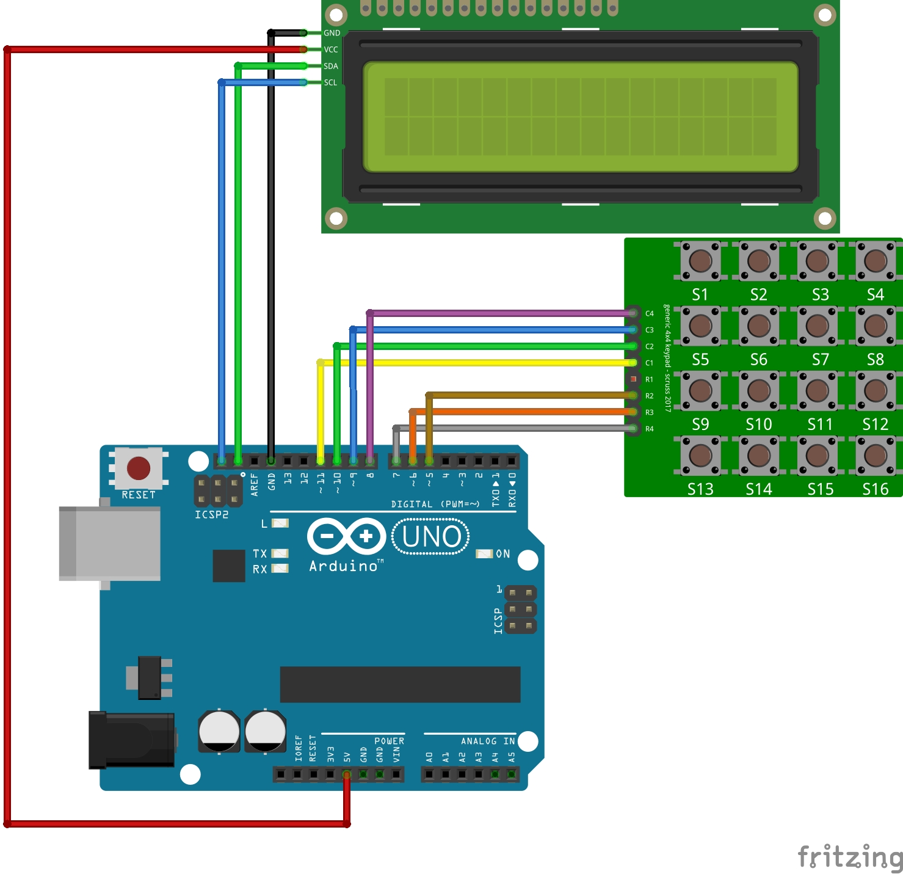
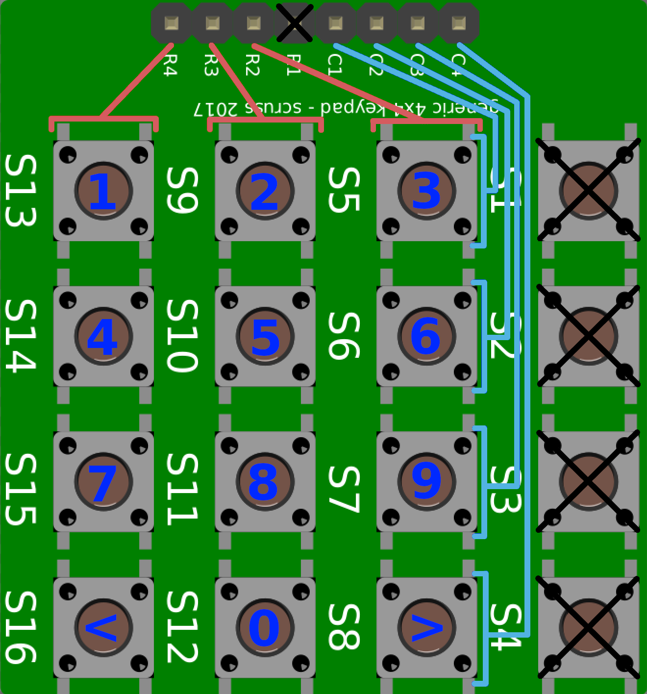

# Použité součastky

- Arduino UNO
- LCD 1602 s I2C rozhraním
- Klavesnice 4x4

# Zapojení

# Klavesnice

Modrými písmeny je označeno, jak jsou tlačítka pojmenována.

### Poznámky

- Klávesnice má 4 řádky a 4 sloupce. Pro svůj projekt nevyužívám jeden ze sloupců, proto není zapojen.
- Tlačítka "<" a ">" většinou znamenají "zpět" a "potvrdit", resp.